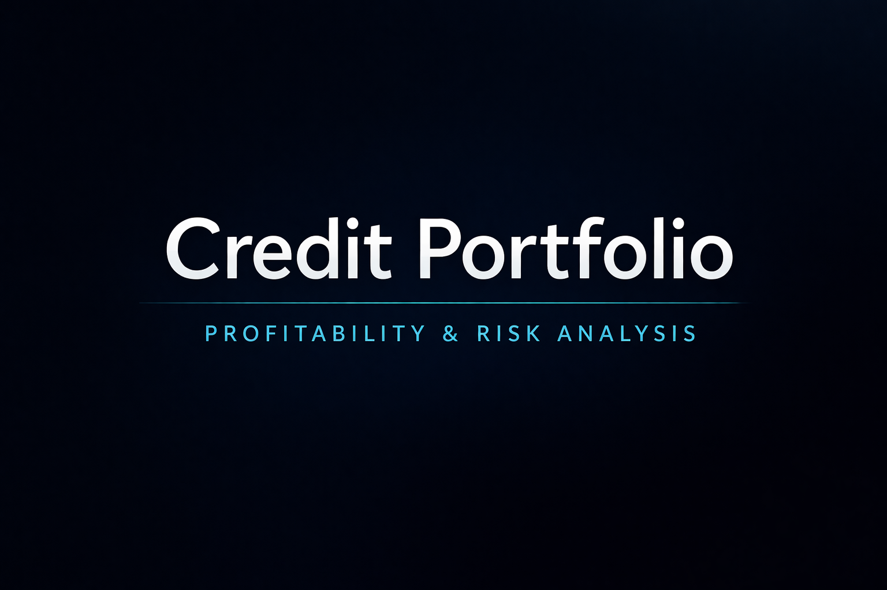
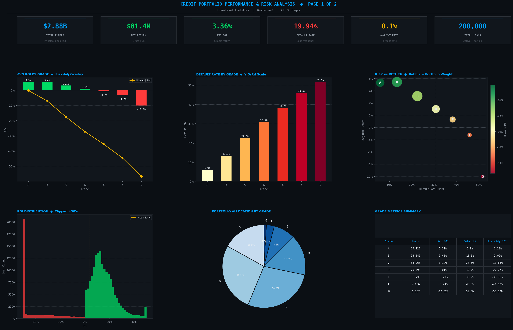
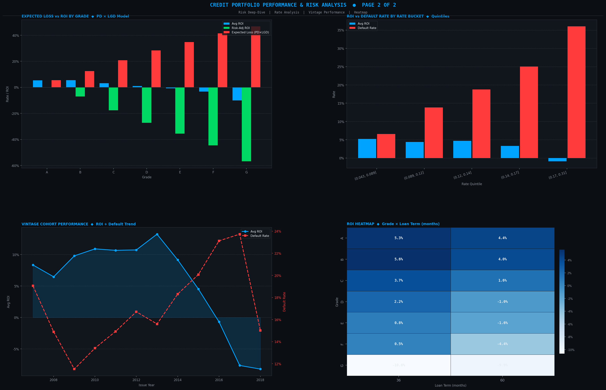

# Credit Portfolio Profitability & Risk Analysis

An end-to-end Python analytics pipeline for evaluating loan portfolio profitability, credit risk, and risk-adjusted returns using Lending Club loan data.

The central question this project addresses is one that gets overlooked when portfolios are evaluated on gross yield alone: **do high-interest loan segments actually generate superior returns once default losses are accounted for?** In most cases, the answer is no — and this pipeline makes that quantifiable.

---

## Background & Motivation

Lending Club's publicly available loan data offers a rare opportunity to apply institutional-grade credit risk frameworks to real portfolio data. The dataset covers loans across seven credit grades, multiple issuance cohorts, and two loan terms — which makes it well-suited for studying how risk-adjusted performance varies across portfolio segments.

This project implements the **Expected Loss model**, the same framework underpinning Basel II/III regulatory capital requirements:

```
Expected Loss  =  PD  ×  LGD
Risk-Adj ROI   =  Average ROI  −  Expected Loss

PD  = Probability of Default  (observed default rate per segment)
LGD = Loss Given Default      (1 − Recovery Rate)
```

Using gross ROI alone can significantly overstate performance in high-default segments. The risk-adjusted figure is the more honest number, and it often tells a materially different story.

---

## Business Problem

This analysis was structured around four questions a lending platform or credit-focused investor would actually need answered:

- Which loan grades generate the strongest risk-adjusted returns after expected losses?
- At what interest rate does incremental yield stop compensating for incremental default risk?
- How does loan performance vary across issuance cohorts(vintage analysis)?
- Which credit grades contribute most to portfolio risk and return?

---

## Project Structure

```
credit-portfolio-analysis/
│
├── run_analysis.py              ← pipeline entry point
│
├── src/
│   ├── data_loader.py           ← data validation and cleaning
│   ├── feature_engineering.py   ← ROI, annualised return, default flag, rate buckets
│   ├── risk_metrics.py          ← expected loss model, segment summaries, insights
│   ├── dashboard_builder.py     ← Bloomberg-style two-page dashboard
│   └── report_generator.py      ← executive PDF report and data exports
│
├── data/
│   └── loans_cleaned.csv        ← cleaned dataset
│
├── reports/                     ← all outputs are saved here
│
├── requirements.txt
└── README.md
```

---

## Getting Started

```bash
git clone https://github.com/yourname/credit-portfolio-analysis
cd credit-portfolio-analysis

python -m venv venv
source venv/bin/activate        # Windows: venv\Scripts\activate

pip install -r requirements.txt
```

The repository already contains the cleaned dataset used for analysis:

`data/processed/loans_cleaned.csv`

You can directly run the analysis pipeline without downloading the raw LendingClub dataset.


```bash
python run_analysis.py

# Override default paths if needed
python run_analysis.py --data data/loans.csv --output my_reports
```

---

## Pipeline Outputs

| File | Description |
|------|-------------|
| `dashboard_page1_overview.png` | Portfolio KPIs, ROI by grade, risk vs return scatter |
| `dashboard_page2_risk.png` | Expected loss model, cohort trends, ROI heatmap |
| `portfolio_report.pdf` | 5-page executive report: summary through recommendations |
| `grade_summary.csv` | Grade-level performance metrics |
| `rate_bucket_summary.csv` | ROI and default rate across interest rate quintiles |
| `cohort_summary.csv` | Portfolio performance by issuance year |
| `portfolio_metrics.json` | KPIs in machine-readable format |
| `insights.txt` | Analytical findings |
| `pipeline.log` | Full audit log of the pipeline run |

---

## Dashboard Preview

Portfolio Overview


Risk Analysis


---

## Data Requirements

| Column | Description |
|--------|-------------|
| `funded_amnt` | Loan principal amount |
| `total_pymnt` | Total amount repaid by borrower |
| `term` | Loan term in months |
| `loan_status` | e.g. "Fully Paid", "Charged Off", "Default" |
| `grade` | Credit grade (A–G) |
| `int_rate` | Annual interest rate |
| `issue_d` | Loan issuance date (e.g. "Jan-2015") |
| `recoveries` | Post-default recovery amount |

---

## Key Findings

Analysis of the Lending Club portfolio surfaces several patterns relevant to credit allocation decisions:

- Grade 'A' delivers the least negative risk-adjusted return (-0.22%) after accounting for a 5.9% default rate. Recommended for portfolio overweight.

- Grade 'G' has the lowest risk-adjusted ROI (-56.83%). High nominal yield is fully eroded by default losses — avoid or underweight.

- Grade 'G' carries the highest default rate (51.6%). Position sizing must reflect tail-risk exposure.

- The interest-rate sweet spot is bucket '(0.043, 0.089]' (avg 0.1%), producing the highest raw ROI (5.22%). Above this band, incremental default losses outpace the extra interest income.

- Loans issued in 2013 showed the highest average ROI. Recent vintages are under-represented due to incomplete loan lifecycles — survivorship bias caution applies.

- Portfolio-level risk-adjusted ROI is -15.03% versus a gross average ROI of 3.36%. The 18.39% spread represents the expected-loss drag on portfolio returns.

- Overall, the analysis suggests that the Lending Club portfolio's risk profile is heavily influenced by lower-grade loans, where high nominal yields fail to compensate for elevated default risk. Portfolio performance could improve through greater allocation to higher-quality grades and tighter exposure limits on speculative segments.

---

## Development Notes

• The full Lending Club dataset contains over 1M rows; a smaller subset was used during development to speed up iteration.

• Dashboards were designed with a Bloomberg-terminal style layout to replicate dense financial analytics environments.

• The pipeline architecture separates data ingestion, feature engineering, analytics, and reporting to keep each stage reusable.

---

## Technologies

Python · Pandas · NumPy · Matplotlib · Seaborn

Analytical methods: financial risk modelling (PD/LGD/EL framework), portfolio segmentation, cohort analysis, automated reporting.

---

## Potential Applications

This framework is directly applicable to:

- Lending platforms assessing credit portfolio performance
- Fintech and credit analytics teams building internal risk dashboards
- Investors evaluating peer-to-peer or direct lending exposure
- Analysts building automated reporting pipelines for portfolio monitoring

---

*This project demonstrates an end-to-end analytics workflow — from raw data through risk modelling to executive-ready deliverables — using publicly available financial data.*
